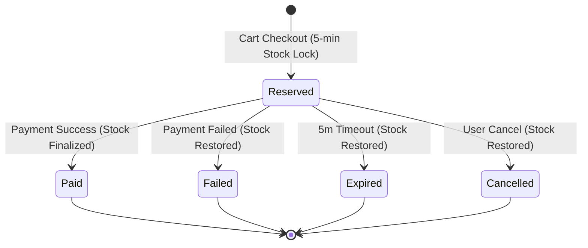

# 🚀 POS Order & Inventory System

A high-performance, concurrency-safe Point-of-Sale (POS) backend and modern React frontend with atomic stock reservation, automated 5-minute expiry, mock payment processing (success, failure, timeout), idempotency guards, full order lifecycle handling, and an interactive real-time race condition simulator.

---

## 🏗️ Architecture & Core Components

```
                        ┌─────────────────────────────────────────┐
                        │      React.js POS Frontend (Vite)       │
                        │  Storefront • Inventory • Orders • Sim  │
                        └───────────────────┬─────────────────────┘
                                            │ HTTP / JSON
                                            ▼
                        ┌─────────────────────────────────────────┐
                        │           Express.js REST API           │
                        │  Product • Order • Payment Controllers  │
                        └───────┬──────────────────────┬──────────┘
                                │                      │
                ┌───────────────▼──────────┐   ┌───────▼─────────────────┐
                │     InventoryService     │   │   5-Min Expiry Worker   │
                │ Atomic $gte Stock Guards │   │ Background Poller (5s)  │
                └───────────────┬──────────┘   └───────┬─────────────────┘
                                │                      │
                                └───────────┬──────────┘
                                            ▼
                        ┌─────────────────────────────────────────┐
                        │                 MongoDB                 │
                        │  Products • Orders • Idempotent Payments│
                        └─────────────────────────────────────────┘
```

---

## ⚡ Concurrency Handling & Zero-Overselling Guarantee

In point-of-sale environments, multiple customers or checkout terminals frequently attempt to purchase the exact same limited-inventory item simultaneously. Naive "read-then-write" patterns cause race conditions leading to negative stock and overselling.

### The Atomic Solution:
Every reservation request executes an atomic conditional update guarded by available stock:
```javascript
const updated = await Product.findOneAndUpdate(
  {
    _id: productId,
    availableStock: { $gte: requestedQty } // Strict concurrency guard
  },
  {
    $inc: {
      availableStock: -requestedQty,
      reservedStock: requestedQty
    }
  },
  { new: true, session }
);

if (!updated) {
  throw new OutOfStockError('Insufficient stock for requested item');
}
```
- **Document-Level Serialization**: Single-document updates in MongoDB are strictly atomic. When 25 requests arrive simultaneously for 5 items, exactly 5 match and decrement; the remaining 20 fail cleanly with `400 OutOfStock`.
- **Multi-Item Cart Rollbacks**: If a multi-product order fails on item $k$, all items $1 \dots k-1$ reserved in that transaction are automatically rolled back.

---

## ⏱️ 5-Minute Stock Reservation & Automated Expiry

- **Lock on Checkout**: The moment a customer proceeds to checkout, an order is created with status `Reserved` and an `expiresAt` timestamp set to `now + 5 minutes` (300 seconds).
- **Dual-Layer Expiry**:
  1. **Active Background Worker (`expiryWorker.js`)**: Runs every 5 seconds, finds all orders with `status: 'Reserved'` and `expiresAt <= now`, atomically transitions them to `Expired`, and returns locked stock to `availableStock`.
  2. **Passive / Lazy Check (`orderService.js`)**: Any query or payment attempt against an expired reservation triggers immediate expiration and rejects the payment.

---

## 💳 Mock Payment Gateway & Idempotency

Supports 3 simulated payment outcomes:
1. **🟢 Success (`outcome: 'success'`)**:
   - Order transitions `Reserved` $\to$ `Paid`.
   - Permanently finalizes inventory (`stock: -qty, reservedStock: -qty`).
2. **🔴 Failure (`outcome: 'failure'`)**:
   - Order transitions `Reserved` $\to$ `Failed`.
   - Immediately restores inventory back to available stock (`availableStock: +qty, reservedStock: -qty`).
3. **🟡 Timeout (`outcome: 'timeout'`)**:
   - Simulates gateway network timeout.
   - Order transitions `Reserved` $\to$ `Expired`, releasing locked stock back to available inventory.

### Duplicate Prevention & Idempotency:
- Every payment request includes an `Idempotency-Key` (in header or payload).
- A unique index on `Payment.idempotencyKey` prevents duplicate transaction entries.
- If a client resubmits the same key (e.g. double-click or network retry), the gateway returns the cached transaction response without double-charging or corrupting inventory.

---

## 🔄 Order Lifecycle State Machine



---

## 🧪 Testing & Verification

### 1. Automated Test Suites (Jest)
Run all 9 unit and integration tests covering concurrency, lifecycle, and payments:
```bash
npm test
```
- `tests/concurrency.test.js`: 25 simultaneous checkout requests competing for 5 items.
- `tests/lifecycle.test.js`: Full lifecycle transitions and stock restoration.
- `tests/payment.test.js`: Success, failure, timeout, and duplicate idempotency.

### 2. Live Terminal Concurrency Stress Test
Run the standalone CLI simulation script:
```bash
node server/scripts/simulateConcurrency.js [requests] [stock]
# Example: 20 simultaneous shoppers for 5 items
node server/scripts/simulateConcurrency.js 20 5
```

### 3. Interactive UI Concurrency Simulator
Navigate to the **"Concurrency Attack Simulator"** tab in the React web dashboard:
- Pick any product.
- Select the number of simultaneous shoppers (5 to 50).
- Click **"Launch Concurrent Attack"** to watch live race-condition resolution!

---

## 🚀 Running Locally

### Prerequisites
- Node.js v18+ (tested on Node v20 LTS)
- (Optional) MongoDB connection string via `MONGODB_URI`. If not set, the application automatically boots an embedded in-memory MongoDB replica set with zero configuration!

### Start Application
```bash
# 1. Install dependencies
cd server && npm install
cd ../client && npm install

# 2. Build client
npm run build:client

# 3. Start full-stack server
npm start
```
Access the application at `http://localhost:5000`.

---

## 📦 Deployment

### Docker Deployment
```bash
docker build -t pos-system .
docker run -p 5000:5000 -e PORT=5000 pos-system
```

### Render.com Deployment
The repository includes a ready-to-use [`render.yaml`](file:///e:/POS%20Order%20&%20Inventory%20System/render.yaml) blueprint for 1-click cloud deployment.
